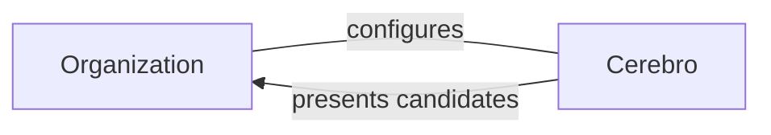

# Introduction

Cerebro assists a organization's recruiting process that uses
GitHub actions to sift through the global developer pool and find suitable
candidates.

Cerebro fits into a relationship with three main entities:

**Organizations**, the end user of Cerebro. Organizations will
configure Cerebro to fit their needs and then run it as a long-standing
service.

**Candidates**, which Cerebro discovers, filters, and presents back to the
organization

  2. Candidates, suitable candidates that Cerebro presents to the company
  3. GitHub, which provide the 

## Containers

To learn more about the various bits and pieces that Cerebro is assembled with:
1. **GitHub**
2. **Node.js**
3. **Heuristics**
